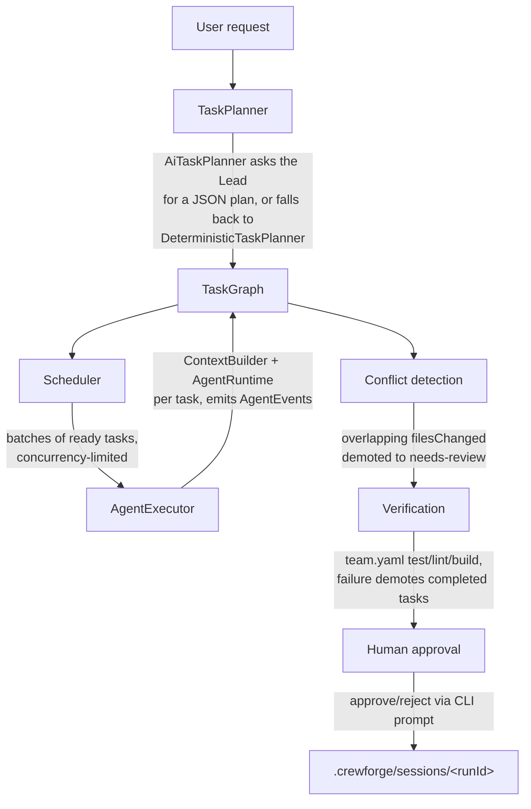
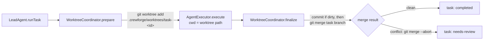

# Architecture

This is the map of how a `crewforge run "<request>"` actually executes, and how the
pieces in `packages/` relate to each other. For the field-level config reference see
[configuration.md](configuration.md); for role definitions see [agents.md](agents.md).

## Layering

```
packages/cli          thin: parses argv, prints output, wires concrete adapters
packages/runtime      AgentRuntime adapters (MockRuntime, CopilotRuntime)
packages/integrations external-system adapters (MCPProvider today)
packages/templates    built-in agent/workflow reference data (no code)
packages/core         all business logic (orchestration, tasks, context, git,
                       verification, permissions, config, memory, events, mcp)
```

`packages/core` never imports from `cli`, `runtime`, or `integrations`. It depends
only on the _interfaces_ it defines itself (`AgentRuntime`, `GitProvider`,
`VerificationRunner`, `ContextBuilder`, `TaskPlanner`, `AgentExecutor`,
`MCPProvider`) — concrete implementations are injected by whichever caller wires
the system together (today, only the CLI does this; a future VS Code extension
would wire the same interfaces differently).

## The pipeline of a single `run`



1. **`TaskPlanner`** (`core/orchestration/task-planner.ts`, `ai-task-planner.ts`)
   turns the request into an ordered list of `Task`s. `AiTaskPlanner` asks the Lead
   agent (via whatever `AgentRuntime` is configured) for a JSON plan; if that call
   fails or returns something unparsable, it falls back to the deterministic
   placeholder planner rather than aborting the run.
2. **`TaskGraph`** (`core/tasks/task-graph.ts`) holds the tasks, enforces the status
   state machine, detects dependency cycles, and computes which tasks are
   currently ready (`getReadyTasks()`).
3. **`Scheduler`** (`core/orchestration/scheduler.ts`) repeatedly asks the graph for
   ready tasks and runs each ready batch concurrently (bounded), advancing the
   graph as results come back — this is where "backend and frontend run in
   parallel, but integration/QA wait" comes from, without any task needing to know
   about scheduling itself. When `workflow.worktrees` is enabled, `LeadAgent` also
   gives each task its own isolated git worktree for this step — see
   [Parallel execution and worktree isolation](#parallel-execution-and-worktree-isolation).
4. **`AgentExecutor`** (`core/orchestration/runtime-agent-executor.ts`) is called
   once per task. It builds that task's `AgentContext` via `ContextBuilder`
   (knowledge files, dependent-task results, prior decisions, and — when a
   `GitProvider` is configured — a capped current working-tree diff), calls the
   injected `AgentRuntime`, records a memory entry, and emits `AgentEvent`s
   (`agent-started`, `agent-completed`/`agent-failed`, ...) to the `EventBus` the
   CLI subscribes to for live output.
5. **`LeadAgent`** (`core/orchestration/lead-agent.ts`) is the object that actually
   owns steps 1–4 for a single run; **`executeRun`**
   (`core/orchestration/run-orchestrator.ts`) wraps it with the two
   post-implementation stages build.md calls out separately:
   - **Conflict detection** (`conflict-detector.ts`): if two completed tasks
     reported changes to the same file, both are demoted back to `needs-review`
     instead of one silently overwriting the other; the Lead can optionally be
     asked (again via `AgentRuntime`) for a suggested reconciliation.
   - **Verification** (`verification/verification-runner.ts`): runs the repo's
     configured `test`/`lint`/`build` commands for real; any failure demotes every
     `completed` task back to `needs-review` too.
6. **Human approval**: the CLI always shows the final files-changed/verification/
   conflict summary and, unless `team.yaml`'s `workflow.human_approval` is `false`,
   asks `Approve changes? [y/N]` before marking anything `approved`. This is a
   second, always-on gate — separate from `ApprovalGate`
   (`core/permissions/approval-gate.ts`), which is the reusable policy-driven gate
   for a single dangerous _action_ (see below).
7. The run is persisted as it goes (`core/tasks/task-store.ts`, live graph under
   `.crewforge/tasks/current/`) and archived once finished
   (`core/sessions/session-store.ts`, `.crewforge/sessions/<runId>/summary.json`),
   which is what `crewforge status`/`crewforge history` read back.

## Permissions and approval

`PermissionEvaluator` (`core/permissions/permission-evaluator.ts`) classifies a
proposed `PermissionAction` as `allowed`, `denied`, or `requires-approval` given a
`PermissionPolicy` (team-wide, from `team.yaml`, optionally narrowed per agent).
Some action kinds (`file-delete`, `deployment`, `git-push-protected-branch`,
`git-merge`, `db-migration`, `security-config-change`, `credential-write`,
`conflict-resolution`) always require approval, regardless of policy — see
build.md's human-in-the-loop list.

`ApprovalGate` (`core/permissions/approval-gate.ts`) is the single choke point that
consumes an evaluator's verdict: `allowed`/`denied` resolve immediately with no
human involved, `requires-approval` emits `approval-requested`/`approval-resolved`
events and awaits an `approve`/`reject`/`modify`/`retry` decision from whatever
`decide` callback the caller supplies (the CLI's is a `readline` prompt). This is
intentionally decoupled from any concrete tool-execution layer — CrewForge's agents
don't yet execute arbitrary shell commands or file writes themselves (see
[workflows.md](workflows.md) for what they do today), so today `ApprovalGate` is
exercised for conflict-resolution suggestions; it's the extension point a future
"agents can actually run commands" capability would gate through.

## Why `AgentRuntime` is a core-owned interface

`AgentRequest`/`AgentResult`/`AgentRuntime` are defined in
`core/agents/agent-runtime.ts`, not in `packages/runtime`. `packages/runtime`
re-exports them from its own `runtime.ts` (matching the file layout build.md
specifies) and provides the two adapters:

- `MockRuntime` — deterministic, scriptable, no network. Default whenever no AI
  credentials are configured, and the only runtime any automated test uses.
- `CopilotRuntime` — an OpenAI-compatible chat-completions adapter (default
  endpoint `https://models.github.ai/inference`, bearer token from
  `CREWFORGE_MODEL_API_KEY`/`GITHUB_TOKEN`). There is currently no public,
  standalone Node.js SDK for invoking GitHub Copilot outside the VS Code
  extension host — this adapter is a deliberately provisional stand-in until a
  real `vscode.lm`-backed runtime exists (see the VS Code extension phase in
  build.md, not yet built).

Keeping the interface in `core` means core never depends on `packages/runtime` (no
import cycle), and a future runtime package can implement the same interface
without core changing at all.

## Parallel execution and worktree isolation

By default, parallel tasks (e.g. backend and frontend running at the same time)
all execute against the same working tree. `AgentExecutor` implementations today
never actually write files to disk themselves — `filesChanged` is self-reported by
the agent/runtime — so this is safe, and `ConflictDetector` (above) catches
overlapping self-reported file lists after the fact.

Setting `workflow.worktrees: true` in `team.yaml` turns on real, git-level
isolation for the future where agents _do_ write files directly, and is fully
functional today:



- **`WorktreeCoordinator`** (`core/git/worktree-coordinator.ts`) is the component
  `LeadAgent` delegates to when `worktrees` is configured. `prepare(taskId)` runs
  `git worktree add -b crewforge/task-<id> .crewforge/worktrees/task-<id>` from the
  main repo and hands the task's `AgentExecutor.execute()` call a `cwd` scoped to
  that directory (surfaced to agents as `AgentContext.workingDirectory`, and used
  to scope that task's own relevant-diff lookup). `finalize()` commits anything
  left in the worktree, merges its branch back into the main checkout, and always
  removes the worktree afterward — even on a conflict.
- **Real conflicts, not just self-reported ones**: if the merge fails,
  `LocalGitProvider.merge()` runs `git merge --abort` (never leaves a repo in a
  conflicted state) and reports `conflicted: true`. `LeadAgent` demotes that task
  to `needs-review` and records a `WorktreeConflict { taskId, branch, output }` on
  the run summary — a second, git-grounded conflict signal alongside
  `ConflictDetector`'s self-reported-file-list heuristic.
- **Serialized merges, parallel execution**: `git worktree add`/`merge` mutate
  the _shared_ repository (refs, index, worktree metadata), so concurrent calls
  from two tasks racing to merge at once could corrupt or lock each other out.
  `WorktreeCoordinator` serializes `prepare()`/`finalize()` through an internal
  FIFO queue — but a task's actual `AgentExecutor.execute()` call, which happens
  _between_ those two calls, still runs fully in parallel with other tasks. Only
  the quick "join the shared repo" moments are serialized.
- **Requires a real git repository**: `crewforge run` checks for `.git` up front
  and raises a clear `ValidationError` if `workflow.worktrees` is enabled outside
  one, rather than letting `git worktree add` fail with a raw stderr dump.
- `createWorktree()`/`removeWorktree()`/`merge()` are plain `GitProvider` methods
  (`core/git/git-provider.ts`), so any future `GitProvider` implementation gets
  worktree isolation for free by implementing the same three methods.

## MCP (Model Context Protocol) support

`MCPProvider` (`core/mcp/types.ts`) is the interface: `connect()`, `disconnect()`,
`listTools()`, `callTool(server, tool, args)`. Like `AgentRuntime` and
`GitProvider`, core only defines the contract — the concrete implementation,
`McpClientProvider`, lives in `packages/integrations` (the package build.md's
project structure calls out for external-system adapters) and is built on the
official `@modelcontextprotocol/sdk`, not a hand-rolled protocol implementation.

```
team.yaml: mcp.servers  -->  McpClientProvider.connect()  -->  per-server stdio
   (name/command/args,          (one child process each,        child process
    or a preset shorthand)       failures isolated per server)   running the
                                                                  actual MCP server
```

- **Config**: `mcp.servers` entries are either a full `{ name, command, args, env }`
  launch spec, or a bare string that must match a small built-in preset table
  (`github`, `postgres`, `playwright`, `filesystem` — resolved to the matching
  official `@modelcontextprotocol/server-*` package via `npx`). Validated by
  `mcpServerConfigSchema` in `team-config-schema.ts`.
- **Connecting**: `connectConfiguredMcpServers()` (`packages/cli/src/mcp.ts`)
  builds one `McpClientProvider` for all configured servers and connects to each
  over stdio. A single server failing to start (not installed, bad command, ...)
  is reported through `onConnectionError` and never blocks the others or the run
  — CrewForge surfaces it as an `agent-message` event instead of failing.
- **Reaching agents**: `crewforge run` passes the connected provider into
  `RuntimeAgentExecutor`, which calls `listTools()` best-effort per task (same
  "never fail the run" treatment as the git diff lookup) and adds the results to
  `AgentContext.availableTools`. `CopilotRuntime`'s prompt renderer lists them
  under "Available MCP tools" so the model at least knows what exists.
- **What's not built yet**: agents don't have a tool-calling loop today (every
  runtime is still single-shot request/response — see
  [Why `AgentRuntime` is a core-owned interface](#why-agentruntime-is-a-core-owned-interface)),
  so `MCPProvider.callTool()` is exercised by tests and by `crewforge mcp` (which
  connects, lists tools, and disconnects, to verify connectivity) but not yet
  invoked automatically mid-run. Wiring an actual tool-use loop into
  `RuntimeAgentExecutor` is a natural next step once a runtime supports it.
- **Testing without spawning processes**: `McpClientProvider` accepts an
  injectable `createTransport()`, which the test suite uses with the SDK's
  `InMemoryTransport` to talk to a real in-process `McpServer` — so the tests
  prove the adapter speaks the actual MCP protocol without needing a real
  subprocess or network access in CI.

## VS Code extension

`packages/vscode` is a thin UI client, same rule as `packages/cli`: it holds no
orchestration logic of its own. Every command it registers calls straight into
`@crewforge/cli`'s command functions (`runRun`, `approveRun`, `runStatus`,
`runTeam`, `runAgents`, `runHistory`, `runDecisions`) — the exact same functions
the terminal CLI calls. This is possible because those functions were designed
from Phase 4 onward as plain, console-I/O-free functions returning structured
data (see [docs/development.md](development.md)); the CLI and the extension are
just two renderers on top of one shared command layer, not two implementations
of "how a run executes."

```
CrewForge (activity bar)
  Team            <- TeamTreeProvider          (runTeam + runAgents)
  Tasks           <- TaskTreeProvider           (runStatus)
  Changed Files   <- ChangedFilesTreeProvider   (runHistory, latest session)
  Decisions       <- DecisionsTreeProvider      (runDecisions)
```

- **Views**: four `vscode.TreeDataProvider`s (`packages/vscode/src/providers/`),
  all built on a small shared `ListTreeProvider` base (flat list, `refresh()`
  re-runs `load()`). This is a deliberately smaller slice of build.md's full
  mockup (which also calls for a task graph diagram, live agent activity, a git
  diff view, verification status, and approval-request UI) — those are natural
  follow-ups on top of the same pattern once there's a live event stream to
  render against, rather than a snapshot-per-refresh.
- **Commands**: `crewforge.run` (input box for the request, `withProgress` while
  it executes, streams `AgentEvent`s to an output channel, then either
  auto-approves or asks via `showInformationMessage` depending on
  `workflow.human_approval` — the same approval semantics as the CLI's prompt);
  `crewforge.approveLatestRun`; `crewforge.refresh`.
- **`VsCodeLmRuntime`** (`packages/vscode/src/runtime/vscode-lm-runtime.ts`) is
  the real Copilot-backed `AgentRuntime` that `CopilotRuntime`'s doc comment
  always pointed to: `vscode.lm.selectChatModels()` +
  `model.sendRequest()`, only possible inside an extension host. It shares
  `renderAgentPrompt()` with `CopilotRuntime` (`@crewforge/runtime`) so both
  adapters build the exact same prompt from an `AgentContext`. The extension
  prefers it automatically and falls back to `MockRuntime` when no Copilot model
  is available (Copilot Chat not installed/signed in).
- **Testing without an Extension Host**: `vscode` only exists inside a real VS
  Code process, so `tests/mocks/vscode.ts` provides a minimal hand-rolled stand-in
  (`TreeItem`, `EventEmitter`, `lm.selectChatModels`, ...) aliased in
  `vitest.config.ts`. This lets `tests/unit/vscode/*.test.ts` exercise the real
  provider and runtime logic — including a fixture-backed run through `runInit`
  — without launching VS Code itself.
- **Running it today**: not published to the Marketplace. From a clone of this
  repo, open `packages/vscode` in VS Code and press `F5` (or
  `code --extensionDevelopmentPath=packages/vscode <some-other-project>`) to
  launch an Extension Development Host with it loaded — see
  [docs/development.md](development.md).
