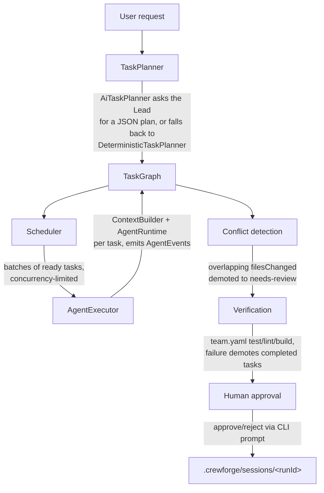

# Architecture

This is the map of how a `crewforge run "<request>"` actually executes, and how the
pieces in `packages/` relate to each other. For the field-level config reference see
[configuration.md](configuration.md); for role definitions see [agents.md](agents.md).

## Layering

```
packages/cli        thin: parses argv, prints output, wires concrete adapters
packages/runtime    AgentRuntime adapters (MockRuntime, CopilotRuntime)
packages/templates  built-in agent/workflow reference data (no code)
packages/core       all business logic (orchestration, tasks, context, git,
                     verification, permissions, config, memory, events)
```

`packages/core` never imports from `cli` or `runtime`. It depends only on the
_interfaces_ it defines itself (`AgentRuntime`, `GitProvider`, `VerificationRunner`,
`ContextBuilder`, `TaskPlanner`, `AgentExecutor`) — concrete implementations are
injected by whichever caller wires the system together (today, only the CLI does
this; a future VS Code extension would wire the same interfaces differently).

## The pipeline of a single `run`



1. **`TaskPlanner`** (`core/orchestration/task-planner.ts`, `ai-task-planner.ts`)
   turns the request into an ordered list of `Task`s. `AiTaskPlanner` asks the Lead
   agent (via whatever `AgentRuntime` is configured) for a JSON plan; if that call
   fails or returns something unparsable, it falls back to the deterministic
   placeholder planner rather than aborting the run.
2. **`TaskGraph`** (`core/tasks/task-graph.ts`) holds the tasks, enforces the status
   state machine, detects dependency cycles, and computes which tasks are
   currently ready (`getReadyTasks()`).
3. **`Scheduler`** (`core/orchestration/scheduler.ts`) repeatedly asks the graph for
   ready tasks and runs each ready batch concurrently (bounded), advancing the
   graph as results come back — this is where "backend and frontend run in
   parallel, but integration/QA wait" comes from, without any task needing to know
   about scheduling itself.
4. **`AgentExecutor`** (`core/orchestration/runtime-agent-executor.ts`) is called
   once per task. It builds that task's `AgentContext` via `ContextBuilder`
   (knowledge files, dependent-task results, prior decisions, and — when a
   `GitProvider` is configured — a capped current working-tree diff), calls the
   injected `AgentRuntime`, records a memory entry, and emits `AgentEvent`s
   (`agent-started`, `agent-completed`/`agent-failed`, ...) to the `EventBus` the
   CLI subscribes to for live output.
5. **`LeadAgent`** (`core/orchestration/lead-agent.ts`) is the object that actually
   owns steps 1–4 for a single run; **`executeRun`**
   (`core/orchestration/run-orchestrator.ts`) wraps it with the two
   post-implementation stages build.md calls out separately:
   - **Conflict detection** (`conflict-detector.ts`): if two completed tasks
     reported changes to the same file, both are demoted back to `needs-review`
     instead of one silently overwriting the other; the Lead can optionally be
     asked (again via `AgentRuntime`) for a suggested reconciliation.
   - **Verification** (`verification/verification-runner.ts`): runs the repo's
     configured `test`/`lint`/`build` commands for real; any failure demotes every
     `completed` task back to `needs-review` too.
6. **Human approval**: the CLI always shows the final files-changed/verification/
   conflict summary and, unless `team.yaml`'s `workflow.human_approval` is `false`,
   asks `Approve changes? [y/N]` before marking anything `approved`. This is a
   second, always-on gate — separate from `ApprovalGate`
   (`core/permissions/approval-gate.ts`), which is the reusable policy-driven gate
   for a single dangerous _action_ (see below).
7. The run is persisted as it goes (`core/tasks/task-store.ts`, live graph under
   `.crewforge/tasks/current/`) and archived once finished
   (`core/sessions/session-store.ts`, `.crewforge/sessions/<runId>/summary.json`),
   which is what `crewforge status`/`crewforge history` read back.

## Permissions and approval

`PermissionEvaluator` (`core/permissions/permission-evaluator.ts`) classifies a
proposed `PermissionAction` as `allowed`, `denied`, or `requires-approval` given a
`PermissionPolicy` (team-wide, from `team.yaml`, optionally narrowed per agent).
Some action kinds (`file-delete`, `deployment`, `git-push-protected-branch`,
`git-merge`, `db-migration`, `security-config-change`, `credential-write`,
`conflict-resolution`) always require approval, regardless of policy — see
build.md's human-in-the-loop list.

`ApprovalGate` (`core/permissions/approval-gate.ts`) is the single choke point that
consumes an evaluator's verdict: `allowed`/`denied` resolve immediately with no
human involved, `requires-approval` emits `approval-requested`/`approval-resolved`
events and awaits an `approve`/`reject`/`modify`/`retry` decision from whatever
`decide` callback the caller supplies (the CLI's is a `readline` prompt). This is
intentionally decoupled from any concrete tool-execution layer — CrewForge's agents
don't yet execute arbitrary shell commands or file writes themselves (see
[workflows.md](workflows.md) for what they do today), so today `ApprovalGate` is
exercised for conflict-resolution suggestions; it's the extension point a future
"agents can actually run commands" capability would gate through.

## Why `AgentRuntime` is a core-owned interface

`AgentRequest`/`AgentResult`/`AgentRuntime` are defined in
`core/agents/agent-runtime.ts`, not in `packages/runtime`. `packages/runtime`
re-exports them from its own `runtime.ts` (matching the file layout build.md
specifies) and provides the two adapters:

- `MockRuntime` — deterministic, scriptable, no network. Default whenever no AI
  credentials are configured, and the only runtime any automated test uses.
- `CopilotRuntime` — an OpenAI-compatible chat-completions adapter (default
  endpoint `https://models.github.ai/inference`, bearer token from
  `CREWFORGE_MODEL_API_KEY`/`GITHUB_TOKEN`). There is currently no public,
  standalone Node.js SDK for invoking GitHub Copilot outside the VS Code
  extension host — this adapter is a deliberately provisional stand-in until a
  real `vscode.lm`-backed runtime exists (see the VS Code extension phase in
  build.md, not yet built).

Keeping the interface in `core` means core never depends on `packages/runtime` (no
import cycle), and a future runtime package can implement the same interface
without core changing at all.
